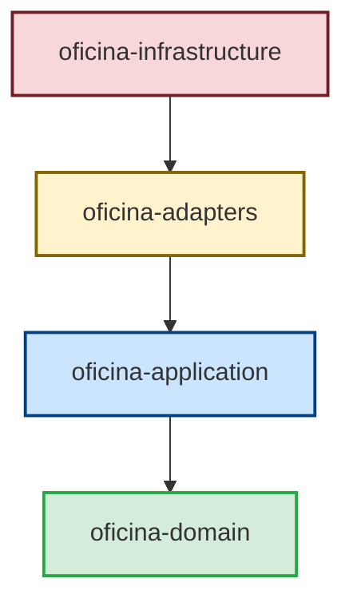
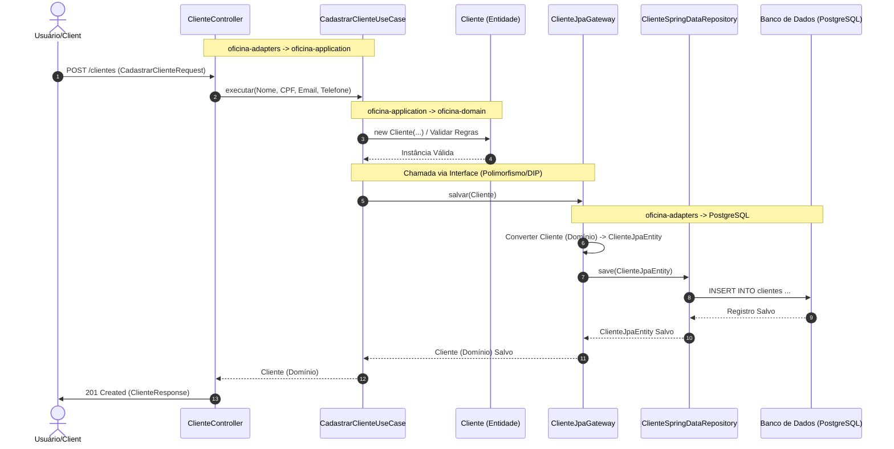

# Projeto Oficina API — Visão Geral de Arquitetura

O projeto é estruturado seguindo os princípios de **Clean Architecture** (Arquitetura Limpa) organizados em um projeto **multi-módulo do Maven**. A principal regra da arquitetura é que as dependências fluam sempre de fora para dentro, isolando as regras de negócio e de aplicação de qualquer dependência externa, frameworks (incluindo o Spring Boot) ou bancos de dados.

## Fluxo de Dependências

A direção de acoplamento do sistema é definida de fora para dentro:

---

## Detalhamento das Camadas (Módulos)

### 1. [oficina-domain](file:///C:/Users/fuzar/Documents/Study/PosGraduacao/Tech-Challenge-15SOAT/oficina-domain) (Núcleo)
Esta camada é o coração do software e é totalmente **independente de frameworks, bibliotecas externas ou persistência**.
*   **Responsabilidades:** Entidades de negócio (`Cliente`, `Veiculo`, `OrdemServico`), regras e validações corporativas, e Value Objects (como `Cpf`, `Email`, `Telefone`).
*   **Independência:** Não há anotações do Spring, Hibernate/JPA, ou qualquer biblioteca de serialização (como Jackson).
*   **Exemplos:**
    *   [Cliente.java](file:///C:/Users/fuzar/Documents/Study/PosGraduacao/Tech-Challenge-15SOAT/oficina-domain/src/main/java/com/mecanica/oficina_api/domain/cliente/Cliente.java): Entidade de domínio pura.
    *   [Cpf.java](file:///C:/Users/fuzar/Documents/Study/PosGraduacao/Tech-Challenge-15SOAT/oficina-domain/src/main/java/com/mecanica/oficina_api/domain/cliente/Cpf.java): Value Object encapsulando validação de CPF.

### 2. [oficina-application](file:///C:/Users/fuzar/Documents/Study/PosGraduacao/Tech-Challenge-15SOAT/oficina-application) (Casos de Uso)
Define o comportamento específico da aplicação, orquestrando o fluxo de dados para e a partir do domínio.
*   **Responsabilidades:**
    *   **Casos de Uso (Use Cases):** Classes contendo a lógica de aplicação (ex: `CadastrarClienteUseCase`, `CriarOrdemServicoUseCase`).
    *   **Interfaces de Portas (Gateways):** Interfaces que declaram os limites do sistema, como operações de repositório e notificações (ex: `ClienteGateway`).
*   **Regras:** Também não possui dependências de frameworks como o Spring. Ela conhece apenas o módulo de domínio.
*   **Exemplos:**
    *   [CadastrarClienteUseCase.java](file:///C:/Users/fuzar/Documents/Study/PosGraduacao/Tech-Challenge-15SOAT/oficina-application/src/main/java/com/mecanica/oficina_api/application/cliente/usecase/CadastrarClienteUseCase.java): Caso de uso para cadastrar clientes.
    *   [ClienteGateway.java](file:///C:/Users/fuzar/Documents/Study/PosGraduacao/Tech-Challenge-15SOAT/oficina-application/src/main/java/com/mecanica/oficina_api/application/cliente/gateway/ClienteGateway.java): Interface (Port) implementada pela camada externa de adaptadores.

### 3. [oficina-adapters](file:///C:/Users/fuzar/Documents/Study/PosGraduacao/Tech-Challenge-15SOAT/oficina-adapters) (Adaptadores de Interface)
Essa camada traduz os dados no formato mais conveniente para as entidades de domínio e casos de uso, e vice-versa.
*   **Responsabilidades:**
    *   **Controladores REST:** Exposição da API HTTP e recepção das requisições (ex: `ClienteController`).
    *   **DTOs (Data Transfer Objects):** Objetos de requisição e resposta específicos para a API Web.
    *   **Implementações de Gateway (Adapters de Persistência):** Implementação concreta das interfaces declaradas na camada de aplicação (ex: `ClienteJpaGateway`).
    *   **Entidades JPA:** Classes mapeadas para tabelas do banco de dados (ex: `ClienteJpaEntity`).
    *   **Configuração de Beans:** O arquivo [ApplicationConfig.java](file:///C:/Users/fuzar/Documents/Study/PosGraduacao/Tech-Challenge-15SOAT/oficina-adapters/src/main/java/com/mecanica/oficina_api/adapters/config/ApplicationConfig.java) funciona como o *Composer Root* do Spring, definindo como os Use Cases (que não possuem anotações `@Component`/`@Service`) são instanciados e injetados com seus respectivos Gateways.
*   **Exemplos:**
    *   [ClienteController.java](file:///C:/Users/fuzar/Documents/Study/PosGraduacao/Tech-Challenge-15SOAT/oficina-adapters/src/main/java/com/mecanica/oficina_api/adapters/web/ClienteController.java): REST API Controller.
    *   [ClienteJpaGateway.java](file:///C:/Users/fuzar/Documents/Study/PosGraduacao/Tech-Challenge-15SOAT/oficina-adapters/src/main/java/com/mecanica/oficina_api/adapters/persistence/ClienteJpaGateway.java): Implementa `ClienteGateway` da aplicação usando JPA.

### 4. [oficina-infrastructure](file:///C:/Users/fuzar/Documents/Study/PosGraduacao/Tech-Challenge-15SOAT/oficina-infrastructure) (Infraestrutura)
A camada mais externa da Clean Architecture, contendo detalhes de baixo nível e a inicialização de frameworks.
*   **Responsabilidades:**
    *   Ponto de inicialização do Spring Boot: [OficinaApiApplication.java](file:///C:/Users/fuzar/Documents/Study/PosGraduacao/Tech-Challenge-15SOAT/oficina-infrastructure/src/main/java/com/mecanica/oficina_api/infrastructure/OficinaApiApplication.java).
    *   Configuração geral do Spring, segurança (Spring Security/JWT) e Swagger (OpenAPI).
    *   Data loaders para ambiente de desenvolvimento.

---

## Fluxo de Execução de uma Requisição (Data Flow)

O diagrama a seguir detalha o fluxo de dados típico para uma operation (ex: Cadastro de Cliente):

## Vantagens dessa Arquitetura

1.  **Testabilidade:** Toda a lógica de negócio (`oficina-domain`) e casos de uso (`oficina-application`) podem ser exaustivamente testados usando testes de unidade rápidos sem a necessidade de levantar o contexto do Spring ou banco de dados.
2.  **Independência de Framework:** Se futuramente a equipe decidir migrar de Spring Boot para Quarkus, Micronaut, ou de banco de dados PostgreSQL para MongoDB, os módulos `oficina-domain` e `oficina-application` permanecerão totalmente intocados.
3.  **Segregação de Responsabilidades:** Separação rígida entre o modelo de visualização (DTOs), modelo persistente (Entities JPA) e modelo rico de domínio (Entities Puras).
