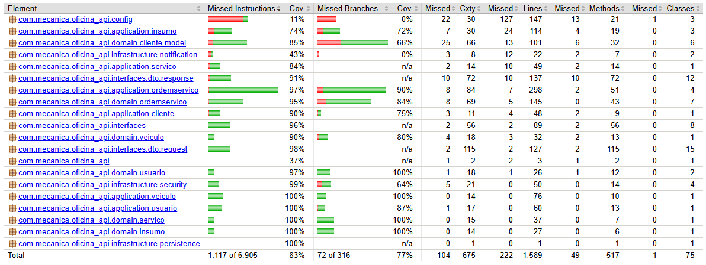
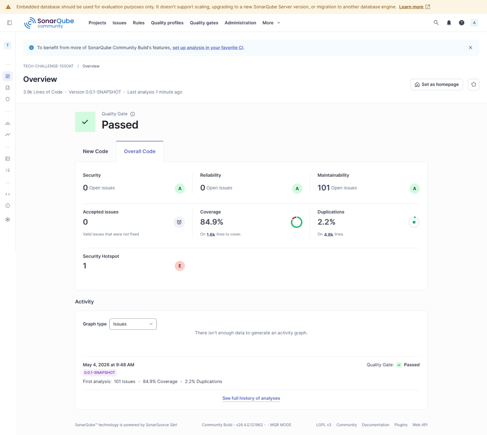

# 🧪 Testes e qualidade

## Executar os testes

```bash
# todos os testes
./mvnw test

# um teste específico
./mvnw test -Dtest=VeiculoTest
./mvnw test -Dtest=CadastrarVeiculoUseCaseTest
./mvnw test -Dtest=VeiculoControllerTest
```

Os testes usam H2 em memória — não é necessário ter o PostgreSQL rodando.

## Estratégia de testes por módulo

Cada módulo tem sua estratégia de teste, respeitando os limites da Clean Architecture:

| Módulo | Tipo | Ferramenta | Spring? |
|---|---|---|---|
| `oficina-domain` | Unitário puro | JUnit 5 + AssertJ | Não |
| `oficina-application` | Unitário com mock de gateway | JUnit 5 + Mockito | Não |
| `oficina-adapters` (controller) | Slice | `@WebMvcTest` + MockMvc | Parcial |
| `oficina-adapters` (JPA) | Slice | `@DataJpaTest` + H2 | Parcial |
| `oficina-infrastructure` | E2E | `@SpringBootTest` + H2 | Completo |

> **Regra:** testes em `oficina-application` nunca importam classes de `oficina-adapters`
> ou `oficina-infrastructure`. Mocke o gateway, não o repositório JPA.

## Testes manuais com Bruno

As coleções [Bruno](https://www.usebruno.com/) estão na pasta `bruno/`, organizadas por
recurso (`auth/`, `usuario/`, `cliente/`, `veiculo/`).

1. Instale o Bruno.
2. Importe a pasta `bruno/` do projeto.
3. Selecione o environment `local`.
4. Execute o request **Auth > Login** — o token JWT é salvo automaticamente no environment
   via script `post-response`.
5. Os demais requests já usam `{{token}}` e ficam prontos para uso.

## Cobertura de testes (JaCoCo)

```bash
mvn clean test jacoco:report
```



## Análise de qualidade e segurança (SonarQube)

Suba o SonarQube local:

```bash
docker run -d --name sonarqube -e SONAR_ES_BOOTSTRAP_CHECKS_DISABLE=true -p 9000:9000 sonarqube:latest
```

Depois siga o passo a passo em
<https://docs.sonarsource.com/sonarqube-community-build/try-out-sonarqube>.


